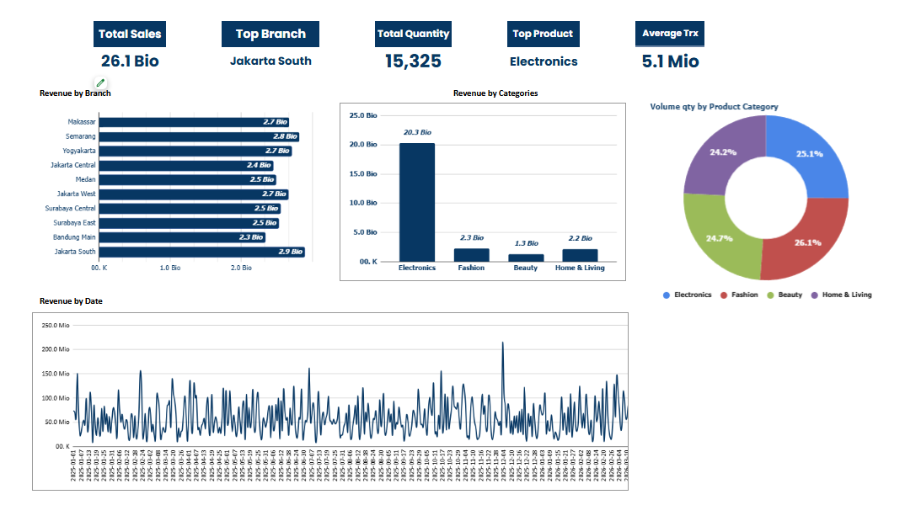
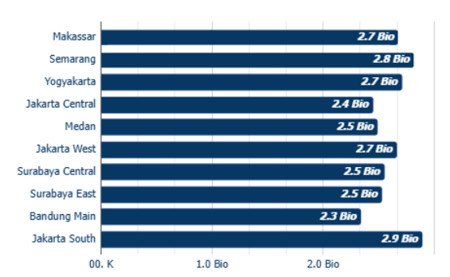
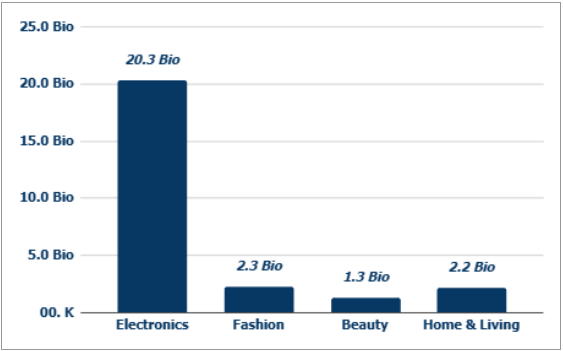
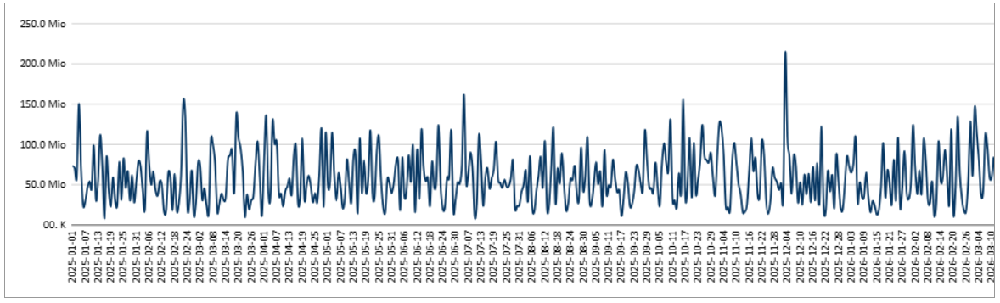

# Sales Dashboard & Trend Analysis

📂 [View Executive Presentation](presentation/The%20Sales%20Tracker%20Dashboard.pptx)

Retail business intelligence dashboard project analyzing branch performance, product contribution, and sales trends to support executive decision-making.

---

# Overview

TokoMart Indonesia operates a multi-branch retail business with diverse product categories. Across branches and categories, sales performance is often uneven, creating challenges in maintaining operational efficiency and business growth. At the same time, management requires fast, data-driven decision-making to effectively manage inventory, promotions, and branch performance.

This dashboard is designed to provide clear business visibility for key stakeholders, including the Head of Commercial and executive leadership (CEO, CFO, COO), enabling faster and more accurate strategic decisions.

The company is currently facing several critical challenges that limit effective decision-making:

> Sales and inventory data are delayed by 2–3 days, making it difficult to respond quickly to high-demand periods such as Ramadan and Lebaran.  
> Management lacks visibility into which branches are outperforming and which require additional investment or operational attention.  
> Promotional strategies are still driven largely by assumptions, without clear insights into the most effective timing or campaign periods.  
> Raw POS data contains multiple inconsistencies and anomalies, requiring significant manual data cleaning.

As a result, the company risks losing growth opportunities, misallocating inventory, and making decisions based on incomplete or inaccurate information.

How can TokoMart Indonesia improve business visibility and generate actionable insights that enable management to make faster, more accurate, and data-driven strategic decisions?

---

# Key Insights

✨ **Electronics** became the strongest revenue contributor across all product categories.

📈 **Weekend sales** consistently performed higher than weekdays, indicating stronger customer activity during weekends.

💳 **Payday periods (1–5)** generated noticeable increases in customer spending behavior.

🏪 **Branch performance gaps** revealed opportunities for operational improvement and strategic optimization.

---

# Dashboard Preview

## Revenue per Branch

---

## Product Category Analysis

---

## Trend Analysis

---

# Business Recommendations

- Increase Electronics stock during weekends
- Run promotions during payday period (1–5)
- Investigate underperforming branches
- Optimize staffing during peak sales periods

---

# Future Improvements

Potential future enhancements include:
- Real-time sales monitoring
- Predictive sales forecasting
- Automated anomaly detection
- Inventory optimization analysis
- Customer segmentation analysis

---

# Author

### Rafly Sean Antonio

Data Analyst Portfolio Project

📧 rseanantonio@gmail.com
